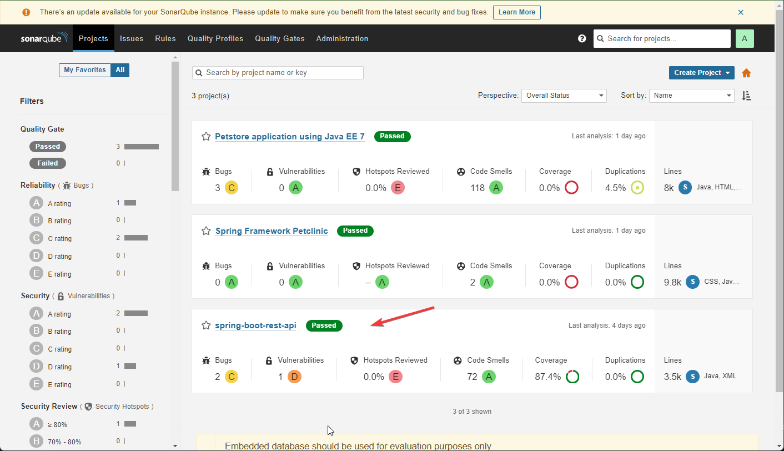
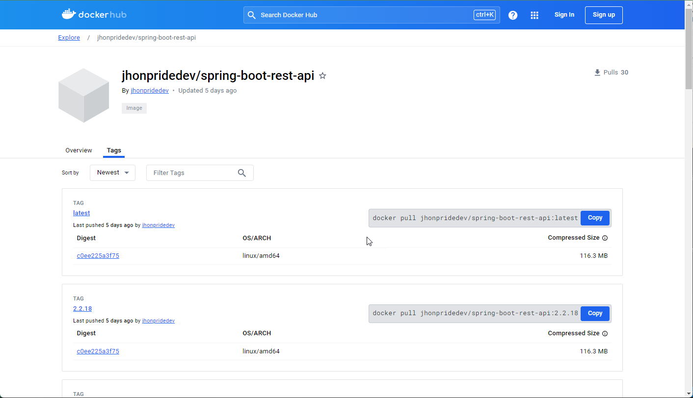
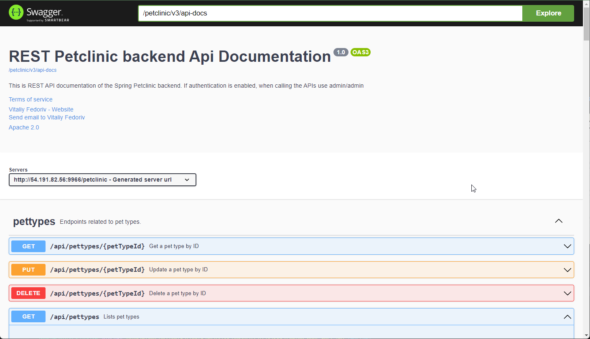

# App Microservicio CI Y CD
El pipeline se encuentra en el job __spring-boot-rest-api__

- __Build__
    - Se realiza el empaquetado en un file .jar
- __Testing__
    - El informe de cobertura generado por Jacoco está disponible en http://54.191.82.56:8080/job/spring-boot-rest-api/lastBuild/jacoco/

- __Sonarqube__
    - Se analiza la calidad del código, cuyos resultados pueden consultarse http://54.191.82.56:9000/dashboard?id=org.springframework.samples%3Aspring-boot-rest-api
    

- __DockerHub__
    - Las imágenes del proyecto están almacenadas en un repositorio público, accesible a través de https://hub.docker.com/r/jhonpridedev/spring-boot-rest-api/tags
    

- __Deploy__
    - El microservicio se despliega en la siguiente URL: http://54.191.82.56:9966/petclinic/swagger-ui/index.html
    

__Nota:__ Los accesos para Sonar y Jenkins se encuentran detallados en el correo electrónico enviado previamente.
